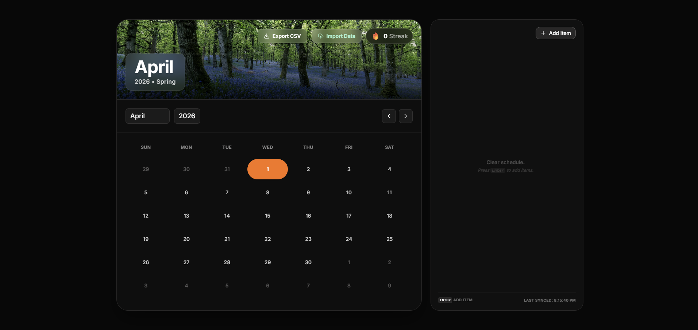

# Productivity Dashboard

A modern, intelligent daily planner featuring glassmorphism design, smooth interactions, and powerful task management.


## Design Approach

While the challenge suggested a wall calendar aesthetic, I chose to interpret it in a modern, product-oriented way inspired by TUF’s revamped UI.

Instead of replicating a literal physical calendar, I focused on:
- Maintaining strong visual hierarchy (hero section + calendar + notes)
- Ensuring usability and responsiveness across devices
- Delivering a clean, scalable interface aligned with real-world product design

This approach balances the spirit of the prompt with practical user experience considerations.

---
> UI inspiration taken from [tuf+](https://takeuforward.org/)
---

## Features

### Core Dashboard

- **Fluid Calendar Grid**  
  Fully dynamic calendar that adapts to each month without heavy third-party libraries.

- **Glassmorphism UI**  
  Translucent panels, backdrop blur, and smooth hover interactions.

- **Dynamic Seasonal Backgrounds**  
  Background changes automatically based on the current month.

---

### Task & Priority Management

- **Timed Tasks** – enables structured daily planning with automatic chronological ordering.

- **Draggable Priority Notes**  
  Flexible notes with drag-and-drop reordering.

- **Multi-Day Bulk Sync**  
  Duplicate tasks or notes across multiple selected dates.

---

### Tracking & Portability

- **Streak Tracking**  
  Track consistency by completing all daily tasks.

- **Data Import/Export**  
  Export or import schedules using `.csv`.

---

## Tech Stack

| Technology | Purpose |
|-----------|--------|
| Next.js (App Router) | Modern frontend architecture |
| Tailwind CSS | Styling and layout |
| Framer Motion | Animations and drag interactions |
| Custom Hooks (`useCalendar.ts`) | State management with localStorage |
| Flexbox | Responsive layout system |

---

## Architecture Notes

- Calendar logic is abstracted into a custom hook (`useCalendar.ts`)
- Local state is persisted using localStorage for offline-first usage
- Component structure is modular for scalability

## Demo

Demo video: [Demo Video](https://drive.google.com/file/d/1xnTNqLlr5w_hb4yeKQbX6234Lg_eRdiv/view?usp=sharing) 

Live app: [Live App](https://tuf-calendar-shivansh-agrawal.vercel.app/)

---

## Screenshots



---

## Challenges Faced

- **Balancing Aesthetics with Usability**  
  Interpreting the "wall calendar" inspiration while ensuring the interface remained intuitive, responsive, and practical for real-world usage.

- **Feature Ideation with Real-World Usefulness**  
  Deciding which features to include based on actual productivity needs—such as priority notes, timed tasks, multi-date selection, and calendar import/export—while avoiding unnecessary complexity.

## Getting Started

### Prerequisites

- Node.js (v18 or higher)

---

### Installation

```bash
npm install
```

---

### Run the App

```bash
npm run dev
```

---

### Open in Browser

```
http://localhost:3000
```

---

## Project Structure

```bash
/app        # App router pages
/components # UI components
/hooks      # Custom hooks
/utils      # Helper functions
/public     # Static assets
```

---

## Future Improvements

- Cloud sync (Firebase / Supabase)
- Authentication
- Multi-device sync
- AI-based task suggestions
- Mobile optimization

---

## Contributing

Feel free to fork the repository and submit a pull request.